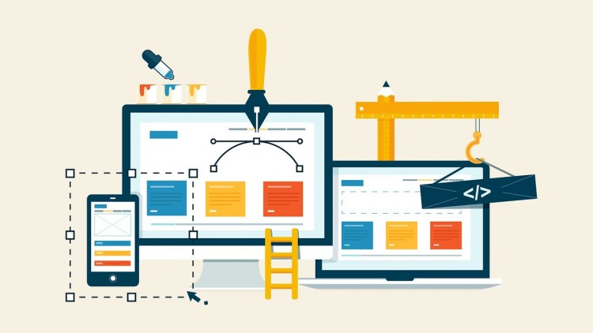
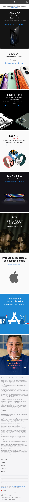
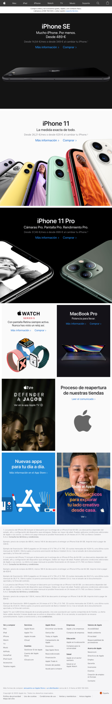
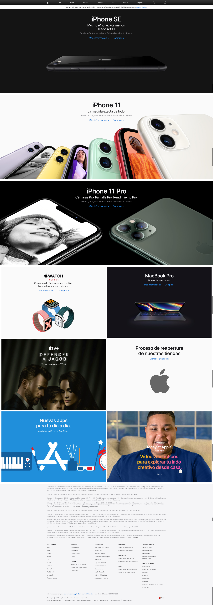

# HTML/CSS S8: Webpage: BEM + SASS + Flexbox + Bootstrap

Hemos llegado a la última sesión de HTML/CSS y ya hemos visto toda la teoría necesaria para comenzar a maquetar `HTML` de manera semánticamente correcta y siguiendo las buenas prácticas.

Luego hemos ido exprimiendo el `CSS` pasando por las reglas más básicas y aprendiendo los tipos de selectores.

Más tarde descubrimos lo que era la **especificidad** y asentamos nuestros conocimientos de **Flexbox**. Descubrimos el **responsive** y como trabajar con el enfoque **mobile-first**.

Por último, hemos empezado a trabajar con **Bootstrap** y a aplicar la metodología **BEM** en nuestras clases para construir unos estilos más modulares y escalables.

La guinda han sido los preprocesadores y **SASS/SCSS**, con lo que ahora podremos estilar nuestras aplicaciones de manera más sencilla y rápida.

Esta última sesión será puramente práctica y los protagonistas seremos todos. Podemos resolver dudas y problemas de ejercicios anteriores o podemos lanzarnos a un último ejercicio práctico.

### Comandos (NODE v16):

Install dependencies (only first time):
> npm install

Dev mode:
> npm start

### Práctica:

Maquetar las versiones mobile, tablet y desktop de la home de Apple. Podemos usar Bootstrap y SASS, y debemos aplicar BEM en las nuevas clases que generemos.

Versión mobile:

Versión tablet:

Versión desktop:

¡Ha sido un placer chicos! Os esperamos con muchas ganas en el siguiente bloque de conocimiento 💪🏼
